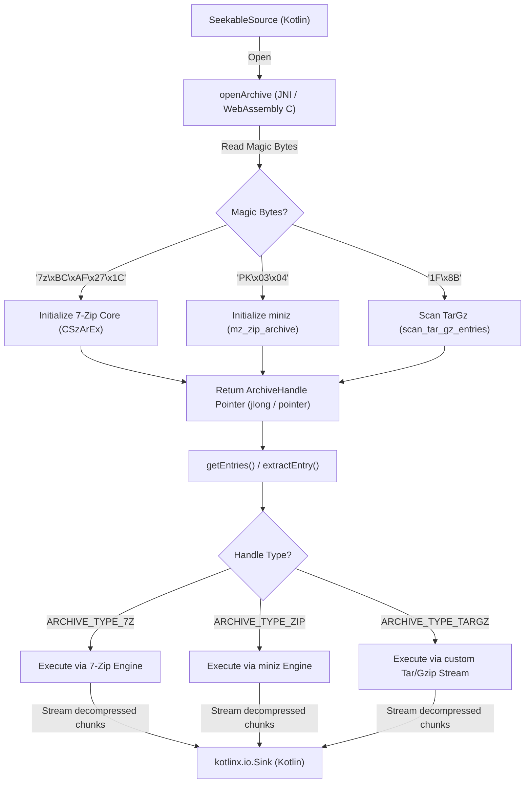

# KioArch Tech Stack, Architecture & Pitfalls (Wasm/JS/JNI)

This rule defines the critical technical architectural principles, data flows, and "pitfalls" (known bugs and solutions) for the KioArch codebase. You must load and adhere to these guidelines at all times.

---

## 1. Core Architectural & Platform Guidelines

### 1.1 Thread Safety
- The Kotlin platform layer (JVM/Android wrapper) sharing JNI handles must be strictly thread-safe.
- Implement appropriate exclusion controls (locks, synchronization, etc.) to handle concurrent access in multi-threaded environments.

### 1.2 Path Normalization
- File path separators within archives (especially ZIP) must be normalized automatically from Windows-style backslashes (`\`) to Unix-style forward slashes (`/`).

### 1.3 Robust Network I/O and Exception Handling
- To handle remote storage connections (such as SMB servers), always perform rigorous exception checks in the JNI layer during disconnections or delays. Avoid any memory leaks or global reference leaks.

---

## 2. WebAssembly (Emscripten) & JS Interoperability Pitfalls

When working with Kotlin/WasmJS and C++ WebAssembly, strict adherence to the following resolutions is mandatory:

### ① Prohibition of Safe Casts (`as?`) on JS External/DOM Objects in Kotlin/WasmJS
- **Problem:** Attempting to safe-cast (`as?`) browser DOM elements (e.g. `HTMLDivElement`) or JS external interfaces in Kotlin/WasmJS always returns `null` due to runtime type validation limitations.
- **Solution:** Verify non-nullity first, and then perform a **forced cast (`as`)** to enable proper smart casting.

### ② Exporting Emscripten Runtime Heaps & Functions
- **Problem:** When Kotlin/Wasm manipulates C memory space, it references heap arrays (such as `HEAP32`) or string conversion functions (`UTF8ToString`). These are dead-code eliminated (DCE) by default, causing "not exported" or "not defined" runtime crashes.
- **Solution:** Add `'UTF8ToString'` and required heaps (`'HEAP8'`, `'HEAPU8'`, `'HEAP16'`, `'HEAPU16'`, `'HEAP32'`, `'HEAPU32'`, `'HEAPF32'`, `'HEAPF64'`, `'HEAP64'`, `'HEAPU64'`) explicitly to the `-sEXPORTED_RUNTIME_METHODS` link options in `CMakeLists.txt`.

### ③ Avoiding C Struct Pass-by-Value Signature Mismatch
- **Problem:** If a C API takes a struct by value (e.g. `kio_open_archive(kio_source_t source, ...)`), the Wasm compiler expands the signature element-by-element. Calling it from JS/Kotlin with a single pointer (32-bit integer) causes a `RuntimeError: function signature mismatch`.
- **Solution:** Do not expose pass-by-value directly to Wasm/JS. Define a C wrapper function taking a pointer (e.g. `kio_open_archive_wasm(kio_source_t *source, ...)`) and call it via pointer from Kotlin.

### ④ Signature Strictness in `addFunction` Callbacks
- **Problem:** Registering JS/Kotlin callbacks dynamically via `addFunction` requires matching the Wasm signature exactly (`i`: 32-bit/pointer, `j`: 64-bit integer, `v`: void, etc.). Specifically, `int64_t` maps to `'j'` (BigInt). Using a mismatched signature (like `'viji'` instead of `'vij'`) will crash with `signature mismatch` on indirect calls (`call_indirect`) from C.
- **Solution:** Align callback arguments/return types strictly with the registration signature (e.g. for `(void *opaque, int64_t pos)` returning `void`, use `'vij'`).

### ⑤ Calling Runtime Utilities via `module` Instance
- **Problem:** Emscripten utilities like `UTF8ToString` do not exist in the global scope; calling `UTF8ToString(...)` directly throws a `ReferenceError`.
- **Solution:** Pass the `module` instance as the first argument in `@JsFun` bridges, and invoke them via the instance: `module.UTF8ToString(namePtr)`.

### ⑥ Japanese Filename Encoding Auto-Detection (Shift_JIS / UTF-8)
- **Problem:** ZIP files created on Windows often encode filenames in **Shift_JIS (CP932)**. Decoding with simple UTF-8 (`UTF8ToString`) causes filename corruption.
- **Solution:** Implement a JS fallback decoder using `TextDecoder` that automatically falls back from UTF-8 to Shift_JIS on decode error:
  ```javascript
  try {
      var utf8Decoder = new TextDecoder('utf-8', { fatal: true });
      return utf8Decoder.decode(bytes);
  } catch (e) {
      var sjisDecoder = new TextDecoder('shift-jis');
      return sjisDecoder.decode(bytes);
  }
  ```

### ⑦ Preventing Wasm Out-Of-Memory (OOM) on Large Archives
- **Problem:** Decompressing 7z (LZMA/LZMA2) or huge ZIP files requires large temporary heap allocation. Exceeding the default 16MB heap limits throws `Cannot enlarge memory arrays`.
- **Solution:** Add `"-sALLOW_MEMORY_GROWTH=1"` link flag to `target_link_options` in `CMakeLists.txt` to automatically expand the HEAP at runtime.

### ⑧ Kotlin/JS `js(...)` Block Variable Mangle Trap
- **Problem:** The Kotlin/JS compiler mangles Kotlin variables (e.g. `wasm` -> `wasm_0`). Code inside `js("...")` blocks referencing `"wasm.HEAPU8"` as literal text bypasses mangling, raising `ReferenceError: wasm is not defined`.
- **Solution:** Wrap the `js(...)` block in an Immediately Invoked Function Expression (IIFE) that takes the target variables as arguments, neutralizing mangling: `(js("function(w) { ... }") ...)(wasm)`.

### ⑨ Conflict with JS Reserved Scope Keyword `module`
- **Problem:** In Node.js, `module` is a reserved global keyword. Using `module` as a property or variable in Kotlin and accessing it in `js(...)` triggers a `ReferenceError` or `TypeError`.
- **Solution:** Avoid the name `module` in Kotlin interop layers; use **`wasm`** or **`jsModule`**. Also, stringify property pointers (e.g. `handle.toString()`) before passing them to IIFEs to bypass minification errors.

### ⑩ Kotlin/JS `Long` Internal Representation Conflict
- **Problem:** Kotlin/JS represents `Long` (64-bit integer) as a Kotlin object rather than a JS `number`/`BigInt`. Passing a raw JS number into `seek(Long)` or passing a Kotlin `Long` directly to JS `BigInt()` causes a `TypeError`.
- **Solution:** Create explicit Double-bridge functions in Kotlin that accept `Double` (JS number) and convert it to `Long` in Kotlin: `bridgeSeek(source, pos.toLong())`.

### ⑪ typedarray and Kotlin `ByteArray` (Int8Array) Conflicts
- **Problem:** Passing a raw JS `Uint8Array` directly to Kotlin `read(ByteArray)` causes a `TypeError`.
- **Solution:** Avoid inline `js(...)` blocks for this; use Kotlin/JS standard WebGL / TypedArray APIs (`org.khronos.webgl.Int8Array` / `Uint8Array`) to copy arrays natively.

### ⑫ Synchronous I/O Limitation in Browser & Web Worker Resolution
- **Problem:** `SeekableSource` requires synchronous `read()`. However, standard Web APIs (Blob, FileReader, Fetch) are asynchronous on the main thread, making on-demand sync loading of huge files impossible without OOM.
- **Solution:** Execute `KioArch` inside a **Web Worker** context. Under Web Worker, use the synchronous **`FileReaderSync`** API to implement `SeekableSource` safely.

### ⑬ Node.js Context File System (`Path`) Support
- **Problem:** Browser security blocks `Path` file-system access, but in a Node.js runtime (server/CLI/tests), synchronous I/O via the `fs` module is possible.
- **Solution:** Dynamically detect the Node.js runtime, dynamically `require('fs')`, and apply a `NodeFileSeekableSource` using sync APIs like `openSync`, `readSync`, and `fstatSync`.

---

## 3. Data Flow

KioArch bypasses the disk filesystem to dynamically load bindings and stream decompressed blocks via memory callbacks:



## 4. JVM/Android JNI Direct ByteBuffer & Zero-Copy Pitfalls

JNI境界でのゼロコピー（`DirectSeekableSource` や `NewDirectByteBuffer` を用いた直接転送）におけるメモリ管理や例外安全上の必須ルール：

### ⑭ JNI `NewDirectByteBuffer` とダイレクトByteBuffer操作における例外安全とローカル参照リークの防止
- **Problem**: `NewDirectByteBuffer` で生成された `jobject` はJNIの「ローカル参照」を消費します。特にループ処理（ストリーミング解凍など）の中で繰り返し生成すると、デフォルトのローカル参照テーブル上限を突破してJVMがクラッシュします。また、Kotlinのコールバック呼び出し中にJVM例外が発生した場合、C++側で適切にC側メモリを解放しないとメモリリークやクラッシュを誘発します。
- **Solution**:
  - `NewDirectByteBuffer` で作成したローカル参照は、使用後に必ず `(*env)->DeleteLocalRef(env, directBuffer)` を用いて即座に明示的に解放すること。
  - Kotlinコールバックの呼び出し（`CallVoidMethod` など）の直後には、必ず `ExceptionCheck(env)` でJVM例外を検知すること。例外が発生している場合は、処理を即時離脱（abort）し、確保していたC++側のメモリ資源（展開バッファやデコーダ等）を適切にクリーンアップした上で復帰すること。
