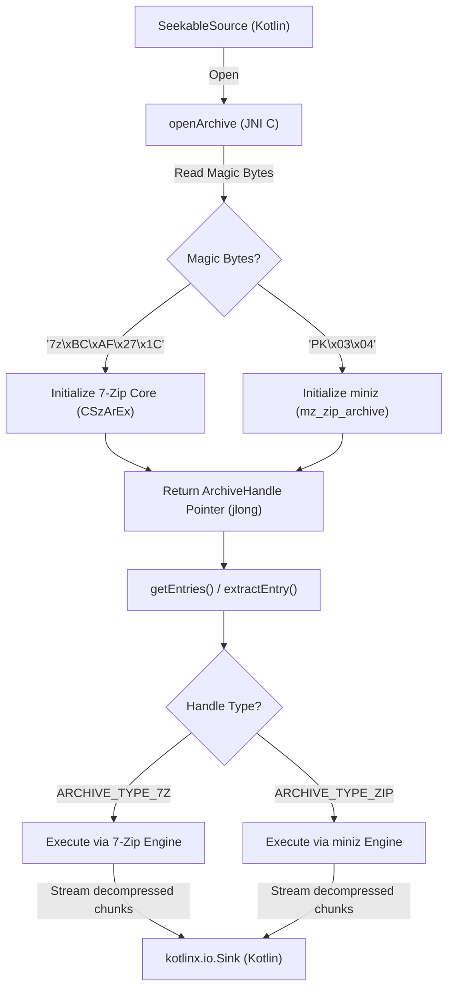

# 📦 KioArch (Kotlin I/O Archive)

[](https://kotlinlang.org)
[](https://search.maven.org)
[](#)
[](#)

**KioArch** is a premium, high-performance Kotlin Multiplatform library for **transparent, filesystem-free archive extraction** (supporting both `.7z` and `.zip` archives). 

Powered by embedded, highly-optimized, pure C native engines (**7-Zip Core** and **miniz**), KioArch offers an elegant KMP API wrapping standard Kotlin I/O (`kotlinx.io.Source` / `kotlinx.io.Sink`) with **zero temporary files** and **$O(1)$ constant memory overhead**.

---

## ✨ Key Features

*   **🛡️ Multi-Format Autoprobe**: Automatically inspects magic bytes (`7z` or `PK`) under the hood to invoke the correct C engine. You call the same unified API regardless of the archive format.
*   **🚀 Filesystem-Free Extraction**: Streams data directly to and from memory-based buffers or custom inputs (e.g. Android Content Provider `Uri`s) without writing any temporary files to disk.
*   **💧 Constant Memory Footprint**: Decompresses files block-by-block and pipes them directly into `kotlinx.io.Sink`, keeping memory usage constant ($O(1)$) even for multi-gigabyte archives.
*   **🛠️ Zero-Config Native Bindings**: Automatically builds, packages, and loads native shared libraries (`.dll`, `.so`, `.dylib`) out of the box without requiring manual library installs.
*   **🔌 100% Isolated Submodules**: Tracks native `7zip` and `miniz` codebases as untouched Git submodules, ensuring safe, continuous updates from upstream.

---

## 📐 Architecture & Flow

KioArch bypasses the filesystem entirely, loading JNI bindings dynamically and using callbacks to decompress data dynamically.



---

## 🚀 Quick Start

### 1. JVM (Java/Desktop) Usage

Extract an archive from a standard JVM `File` directly into a `kotlinx.io` `Sink` or standard file output:

```kotlin
import com.sorrowblue.kioarch.KioArch
import com.sorrowblue.kioarch.createReader
import kotlinx.io.asSink
import java.io.File
import java.io.FileOutputStream

val archiveFile = File("path/to/archive.7z") // or archive.zip

KioArch.createReader(archiveFile).use { reader ->
    // Query catalog entries
    val entries = reader.getEntries()
    println("Total entries: ${entries.size}")

    // Extract a specific entry
    val targetEntry = entries.first { !it.isDirectory && it.name == "notes.txt" }
    
    FileOutputStream(File("extracted_notes.txt")).use { outputStream ->
        val sink = outputStream.asSink()
        reader.extractEntry(targetEntry, sink)
        sink.flush()
    }
}
```

### 2. Android Usage

Perform dynamic archive extraction from an Android content `Uri` (e.g., chosen via the System Picker) without temp files:

```kotlin
import android.content.Context
import android.net.Uri
import com.sorrowblue.kioarch.KioArch
import com.sorrowblue.kioarch.SeekableSource
import kotlinx.io.Buffer
import java.io.FileInputStream
import java.io.IOException
import java.nio.ByteBuffer

// Define a custom SeekableSource wrapping an Android Uri
class UriSeekableSource(context: Context, uri: Uri) : SeekableSource {
    private val pfd = context.contentResolver.openFileDescriptor(uri, "r")!!
    private val fis = FileInputStream(pfd.fileDescriptor)
    private val channel = fis.channel

    override fun read(buffer: ByteArray, offset: Int, length: Int): Int {
        val byteBuffer = ByteBuffer.wrap(buffer, offset, length)
        return channel.read(byteBuffer)
    }

    override fun seek(position: Long) {
        channel.position(position)
    }

    override fun position(): Long = channel.position()
    override fun length(): Long = pfd.statSize

    override fun close() {
        channel.close()
        fis.close()
        pfd.close()
    }
}

// Extraction
fun extractFromUri(context: Context, archiveUri: Uri) {
    val source = UriSeekableSource(context, archiveUri)
    
    KioArch.createReader(source).use { reader ->
        val fileEntry = reader.getEntries().first { !it.isDirectory }
        val buffer = Buffer()
        
        // Decompresses directly to in-memory buffer
        reader.extractEntry(fileEntry, buffer)
        println("Extracted ${fileEntry.name} data size: ${buffer.size} bytes")
    }
}
```

---

## 🛠️ Build & Development

KioArch features fully automated native compilation during Gradle builds. When you run tests or bundle artifacts, CMake runs automatically to build and package native shared libraries directly into your classpath resources.

### Prerequisites

*   **JDK 21**
*   **CMake (4.1.2)**
*   **Android NDK** (for Android cross-compilation)
*   **Compiler Toolchain**: MSVC (Windows), GCC/Clang (Linux), Xcode/Clang (macOS)

### Building and Testing

Run the full clean and JVM test suite:
```powershell
# Set JAVA_HOME path and run
$env:JAVA_HOME="C:\Program Files\Java\jdk-21" 
.\gradlew.bat :kioarch:clean :kioarch:jvmTest
```

Cross-compile all Android native ABIs (`armeabi-v7a`, `arm64-v8a`, `x86`, `x86_64`):
```powershell
.\gradlew.bat :kioarch:assembleDebug
```

---

## 📄 License

```text
Copyright 2026 SorrowBlue

Licensed under the Apache License, Version 2.3 (the "License");
you may not use this file except in compliance with the License.
You may obtain a copy of the License at

    http://www.apache.org/licenses/LICENSE-2.3

Unless required by applicable law or agreed to in writing, software
distributed under the License is distributed on an "AS IS" BASIS,
WITHOUT WARRANTIES OR CONDITIONS OF ANY KIND, either express or implied.
See the License for the specific language governing permissions and
limitations under the License.
```
